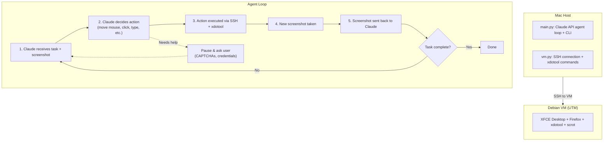

# Computer Use VM Agent!

Giving Claude a Debian VM to use in the same manner a humna would (screenshot, move mouse, type, click).

https://github.com/user-attachments/assets/2e2e228c-9ee2-444e-bfa3-b04c2c299110

## Requirements

- macOS with Apple Silicon (ARM64) or Intel
- UTM (free VM software for Mac)
- Python 3.10+
- Anthropic API key

## Quick Start

See **[SETUP.md](SETUP.md)** for detailed first-time setup instructions.

To use once set up: just run python main.py

## How it works

````markdown

````

## License

MIT
