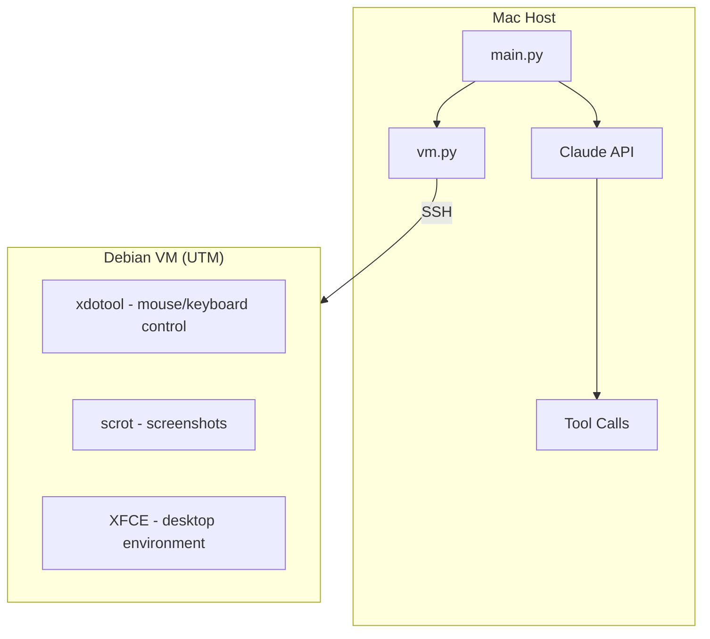

# Computer Use VM Agent!

Giving Claude a Debian VM to use in the same manner as a human would (screenshot, move mouse, type, click).

https://github.com/user-attachments/assets/2e2e228c-9ee2-444e-bfa3-b04c2c299110

## How it works

```mermaid
flowchart TB
    subgraph Mac["Mac Host"]
        main["main.py"] --> claude["Claude API"] --> tools["Tool Calls"]
        main --> vm["vm.py"]
    end

    subgraph VM["Debian VM (UTM)"]
        xdotool["xdotool - mouse/keyboard control"]
        scrot["scrot - screenshots"]
        xfce["XFCE - desktop environment"]
    end

    vm -->|SSH| VM
```
